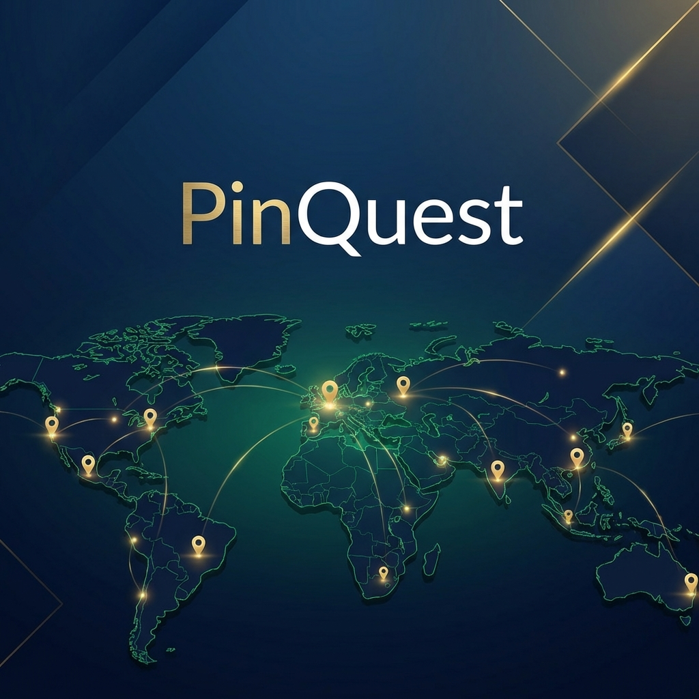

<p align="center">
  
</p>

# PinQuest

PinQuest is a high-fidelity social exploration platform designed to bridge the gap between digital maps and real-world discovery. Built on the modern MERN stack, the application provides a high-performance, real-time interface for users to discover, share, and preserve their favorite locations across the globe with a specific initial focus on the rich cultural landscape of Ethiopia.

## Overview

At its core, PinQuest is more than a simple mapping tool. It is a community-driven spatial repository that leverages real-time synchronization and a premium aesthetic to provide an immersive exploration experience. The platform allows users to interact with a high-performance map, create multimedia-rich posts at exact coordinates, and engage with a global community through likes, comments, and authentic ratings.

The project emphasizes precision and visual excellence, featuring a custom-built design system that integrates glassmorphism, fluid animations, and a responsive layout that adapts seamlessly from desktop workstations to mobile devices.

## Core Features

### High-Performance Interactive Mapping
The platform utilizes a customized implementation of the Leaflet engine, optimized for performance and visual clarity. Features include:
- Precision Coordinate Capture: Logic specifically tuned to ensure map clicks correlate exactly with real-world latitude and longitude.
- Adaptive Layout Invalidation: A custom monitoring system that forces the map to recalculate its dimensions during layout shifts, preventing coordinate drift.
- Clustering and Marker Management: Intelligent grouping of geographical points to maintain map performance and readability at various zoom levels.

### Real-time Interaction and Synchronization
Powered by Socket.io, PinQuest ensures the digital environment feels alive:
- Instant Live Notifications: Real-time alerts for likes, comments, and project updates delivered directly to the user's interface.
- Dynamic Map Synchronization: Live updates to the map as the community adds new landmarks and modifies existing pins.

### Multimedia Content Engine
Users can create detailed, immersive entries for any location:
- Multi-image Integration: Support for high-resolution imagery stored via Cloudinary and Firebase Storage.
- Descriptive Categorization: Extensive categorization for nature, culture, shopping, and more.
- Authentic Ratings and Feedback: A comprehensive system for user ratings and peer reviews to validate the quality of landmarks.

### Security and User Empowerment
- Advanced Authentication: Secure JWT-based auth flow combined with Passport.js for both local and OAuth (Google) providers.
- Password Recovery System: A robust OTP-based flow for secure and verifiable account recovery.
- Administrative Governance: A powerful administration dashboard for content moderation, user management, and platform-wide analytics.

### Navigation and Utility
- Smart Routing: Integrated routing services using the Leaflet Routing Machine to help users find the best path to their next discovery.
- Bookmarks and Favorites: Personalized lists for users to save the hidden gems they intend to visit.

## Technical Architecture

### Frontend Layer
Built with React 19 and Vite, the frontend is designed for maximum speed and reactivity.
- Styling: A hybrid approach using Tailwind CSS 4.0 for utility-first layout and Vanilla CSS for complex, high-fidelity UI components.
- Motion: Framer Motion provides fluid transitions and interactive feedback for a premium user experience.
- State: React Context API handles global state for authentication, notifications, and modal management.

### Backend Layer
The backend is a high-availability Node.js server using Express 5.0.
- Database: MongoDB via the Mongoose ODM handles flexible, geographical schema data.
- Security: Implementation of Helmet, XSS-Clean, and rate-limiting to protect the platform from common attack vectors.
- APIs: A RESTful API architecture following standard JSON patterns for cross-platform compatibility.

## Getting Started

### Prerequisites
- Node.js (version 18 or higher)
- MongoDB Instance (local or Atlas)
- Cloudinary Account (for image management)

### Installation

1. Clone the repository:
   ```bash
   git clone https://github.com/devasol/PinQuest.git
   cd PinQuest
   ```

2. Configure the Backend:
   ```bash
   cd backend
   npm install
   ```
   Create a `.env` file in the `backend` directory with the following variables:
   ```env
   PORT=5000
   MONGODB_URI=your_mondodb_connection_string
   JWT_SECRET=your_jwt_signing_key
   CLOUDINARY_CLOUD_NAME=your_cloud_name
   CLOUDINARY_API_KEY=your_api_key
   CLOUDINARY_API_SECRET=your_api_secret
   SMTP_HOST=your_smtp_provider
   SMTP_PORT=587
   SMTP_USER=your_email_address
   SMTP_PASS=your_email_password
   ```

3. Configure the Frontend:
   ```bash
   cd ../frontend
   npm install
   ```
   Create a `.env` file in the `frontend` directory:
   ```env
   VITE_API_BASE_URL=http://localhost:5000/api/v1
   ```

4. Launch the application:
   Execute `npm run dev` in both the `backend` and `frontend` directories to start the development servers.

## Directory Structure

```text
PinQuest/
├── backend/             # Primary Node.js + Express API
│   ├── controllers/     # Route business logic
│   ├── models/          # Mongoose database schemas
│   ├── routes/          # API endpoint definitions
│   └── socket/          # Socket.io event logic
└── frontend/            # React + Vite Client
    ├── src/
    │   ├── components/  # Atomic and complex UI blocks
    │   ├── contexts/    # Global state management
    │   ├── pages/       # Higher-order route views
    │   └── services/    # External communication logic
```

## License

This project is licensed under the MIT License. Reference the LICENSE file for full legal details.

---

Designed and developed by Dawit S. for modern explorers who seek beyond the ordinary.
